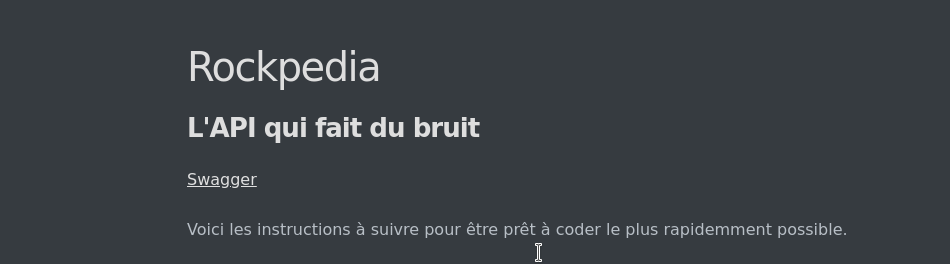

# Rockpedia, l'API qui fait du bruit : Guide de démarrage

Voici les instructions à suivre pour être prêt à coder le plus rapidemment possible.

 		<u>1. Guide général</u>
 			<u>1.1. Prérequis</u>
 			<u>1.2. Démarrer l'application</u>
 		<u>2. Guide du collaborateur</u>
 		<u>3. Surveillance</u>

## 1. Prérequis

Vous aurez besoin des outils suivants :

- Maven (v3.6.3 ou +)
- JDK8
- Git
- un IDE (nous conseillons Intellij si possible)
- un compte Github (pour pouvoir commit)
- un compte sur la plateforme Jenkins

## 2. Démarrer

- Cloner le dépot :
> `git clone https://github.com/ALudwig57/Rockpedia`

- Build avec maven
>`mvn install`

- Executer les tests unitaires
>`mvn test`

- Executer tous les tests (unitaires et intégration)

> `mvn verify -Psurefire`

- Build un package
> `mvn package`

- Démarrez l'application
>`mvn spring-boot:run`

- Rendez vous à l'adresse [http://localhost:8080/](http://localhost:8080) avec un navigateur 

Vous devriez voir apparaître cette page :

