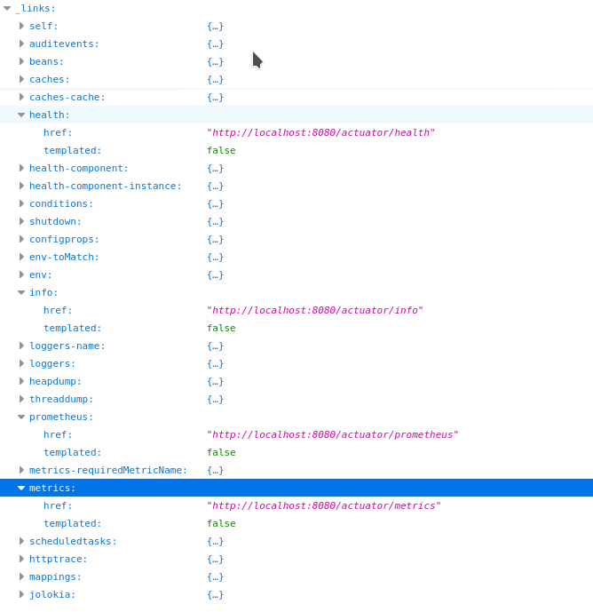
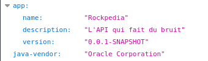
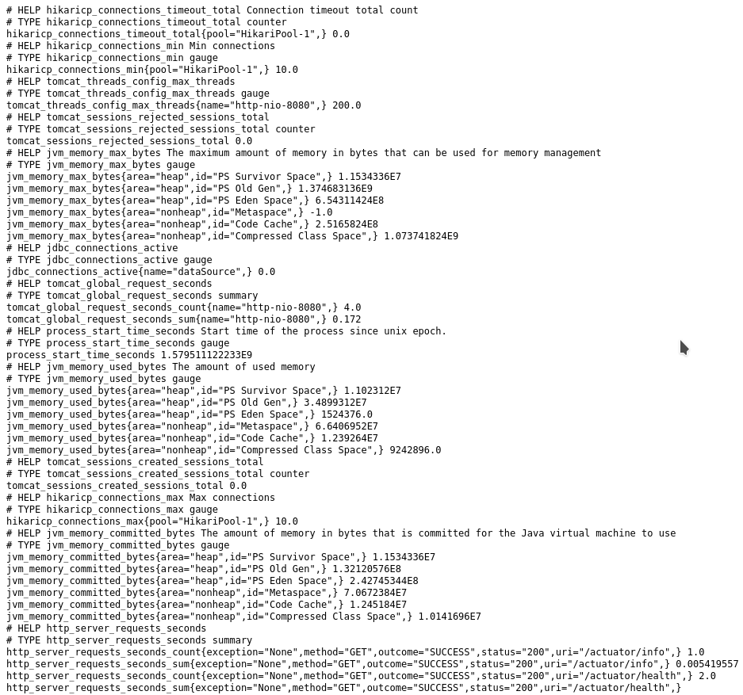
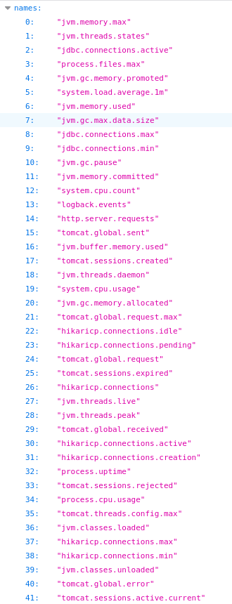
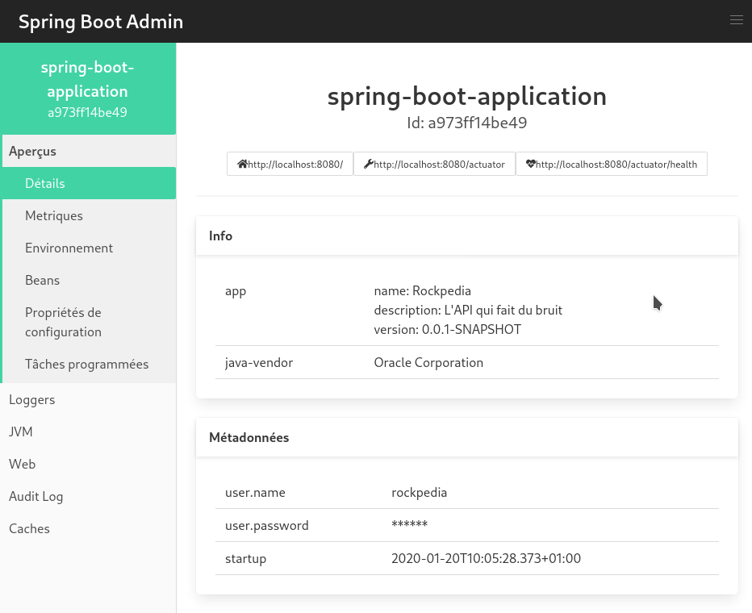

# Rockpedia : Surveillance

<u>3. Rockpedia : Surveillance</u>
			 <u>3.1. Spring Actuator et Prometheus</u>
 			<u>3.2. Spring Boot Admin</u>

Nous voulons toujours savoir si notre application fonctionne correctement, une fois lancée. C'est ce que permettent les outils que nous allons voir.

## 1. Spring Actuator et Prometheus

Spring Actuator est déjà activé. Cela permet de voir pas mal d'infos relatives à l'application à l'adresse [http://localhost:8080/actuator](http://localhost:8080/actuator).

 

J'ai mis en évidence les plus utiles :

- health : permet de savoir si l'application fonctionne (UP) ou pas

  

- info : informations générales sur l'application

  

- prometheus : beaucoup d'informations pas très lisibles, surtout utilisé par des applications externes comme graphana ou Spring Boot Admin, que nous allons voir dans un instant.

- metrics : données de surveillance, accessibles à l'adresse [http://localhost:8080/actuator/metrics/${DATA}](http://localhost:8080/actuator/metrics) (avec ${DATA} le nom de ce que vous voulez inspecter)

## 2. Spring Boot Admin

- Clonez le dépot :

> `git clone https://github.com/SmileEdge/SpringBootAdmin.git`

- Build avec maven

>`mvn build`

- Démarrez l'application

>`mvn spring-boot:run`

- Rendez vous à l'adresse [http://localhost:8081/](http://localhost:8081) avec un navigateur, connectez-vous avec le nom d'utilisateur *admin* et le mot de passe *admin* et selectionnez l'application *spring-boot-application* en cliquant une fois dessus, puis sur le numéro sous l'adresse [http://localhost:8080/](http://localhost:8080).

Sur la page d'accueil, on peut voir les mêmes infos que par la route info de Spring Actuator, le nombre de threads de l'application, la mémoire utilisée, le nombre de passages du garbage collector...

Aperçus \> Metriques permet d'ajouter des métriques visibles sur actuator/metrics.

Aperçus \> Envirronement liste les variables d'environnement de l'application.

Aperçus \> Propriétés de configuration liste d'autres variables d'environement, plus spécifiques à Spring.

Loggers permet de définir la priorité des logs à afficher (DEBUG < FATAL).